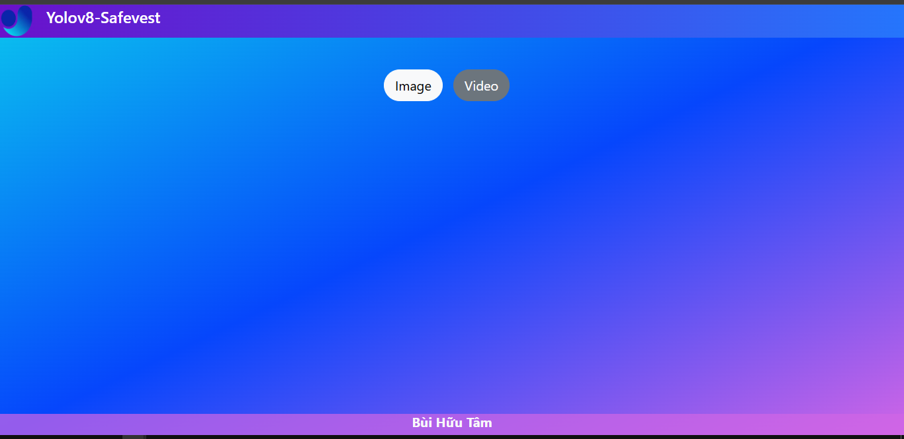

# SafeVest

Mục đích xây dựng website đơn giản sử dụng yolov8 để phát hiện đối tượng trên ảnh và video.

---

## Mục Lục 
- [Giới thiệu](#giới-thiệu)
- [Cài đặt](#cài-đặt)
- [Sử dụng](#sử-dụng)
- [Tính năng](#tính-năng)
- [Công nghệ](#công-nghệ)
- [Giao Diện](#giao-diện)
- [Tác giả](#tác-giả)

---

## Giới thiệu
Dự án này sẽ phát hiện ai có mặc đồ bảo hộ và ai không mặc, chức năng ở đây là phát hiện đối tượng và chia làm 2 nhãn là : vest và no-vest.

## Cài đặt 
 - git clone https://github.com/buihuutam05062002/safevest.git
---

## Sử dụng

- Tại giao diện của vscode kéo dự án vào.
- Mở terminal trong đó hoặc phím tắt cmd+shift+`.
- Trong cửa sổ terminal gõ python app.py.
- Bấm vào Running on http://192.168.100.230:5000 hoặc http://127.0.0.1:5000 trong phần cửa sổ .
- Sau đó giao diện sẽ được kích hoạt và bạn có thể giao tác.

--- 
## Tính năng

 - Phát hiện đối tượng trên ảnh.
 - Phát hiện đối tượng trên video.
---
## Công nghệ
 - Yolov8
 - cv2
 - Flask
 - bootstrap 5

---
## Giao Diện

 ## Tác Giả

Tên: Bùi Hữu Tâm
Gmail: buihuutam05062002@gmail.com || tam01296275375@gmail.com
GitHub: https://github.com/buihuutam05062002
